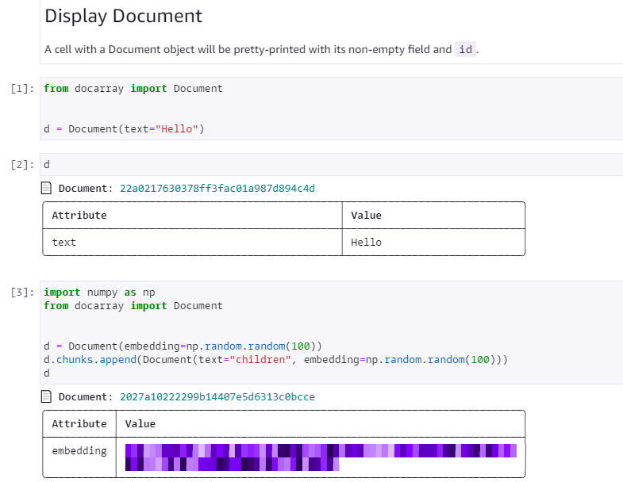

# jina-demo

## Jina

Demonstration of [JINA](https://github.com/jina-ai/jina), cross-modal and multi-modal data store.

## Discoart

**Recommend to use GPU**

Demonstration of [Discoart](https://github.com/jina-ai/discoart) to create Disco Diffusion artworks.

